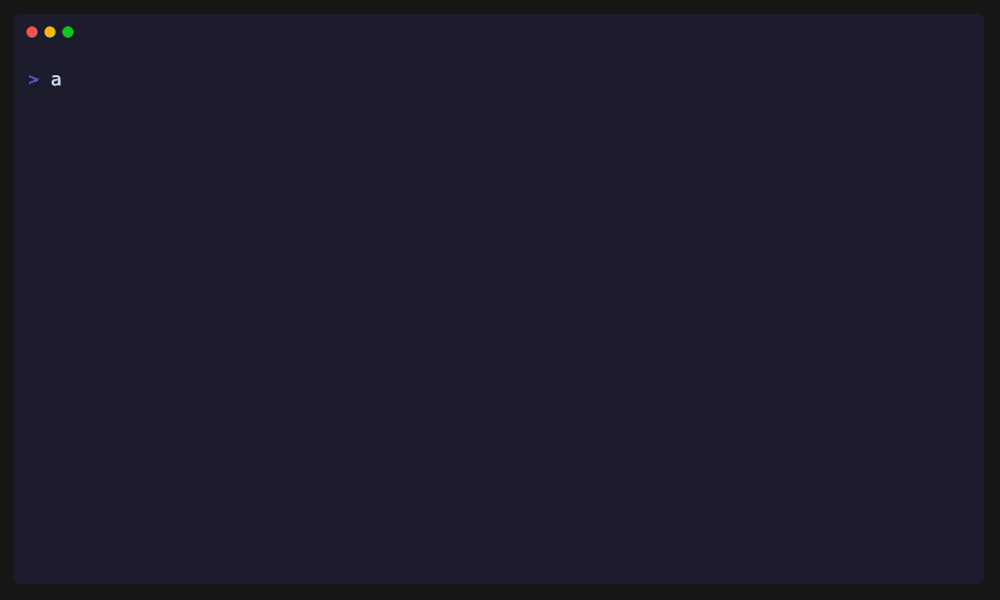

# agent-scope

[](https://www.npmjs.com/package/@floomhq/agent-scope)
[](https://opensource.org/licenses/MIT)
[](./tests)

**Scoped write access for AI coding agents.**

Stop Claude, Cursor, Codex, and other coding agents from silently changing code outside their intended task boundary. Give them broad read access, narrow write access, and enforce approval for protected modules.

```bash
npm install -g @floomhq/agent-scope
```

---

## Demo

<p align="center">
  
</p>

## The problem

You ask an agent to *"fix the settings page."* It changes:

- `apps/web/settings/page.tsx` ✅ intended
- `packages/auth/session.ts` ❌ silently broken
- `package-lock.json` ⚠️ unexpected side effect
- Some random utility file ❌ now broken

**agent-scope** makes this visible, preventable, and fixable *before* it hits production.

## Philosophy: boundary guard, not correctness oracle

**agent-scope** solves a specific problem: **cross-module contamination**. It does not try to prove your code is correct — your tests do that.

| Layer | Responsibility | Example |
|-------|---------------|---------|
| **agent-scope** | *Which files can change?* | Block auth, billing, migrations unless approved |
| **tests / typecheck / lint** | *Did the code break?* | Sidebar buttons still work after top-bar fix |
| **human review** | *Should this change exist at all?* | Approve a protected-file change with justification |

This separation is intentional. A tool that tries to do everything becomes a cop. A tool that does one thing well becomes a guardrail.

## The solution

```yaml
# agent.scope.yml
version: "0.1"
mode: strict

task:
  id: "email-settings-v2"
  title: "Add onboarding email settings"

scope:
  read:
    - "**/*"
  write:
    - "apps/web/settings/**"
    - "packages/email/**"
  protected:
    - "packages/auth/**"
    - "packages/billing/**"
    - "db/migrations/**"
  approval_required:
    - "package.json"
    - "pnpm-lock.yaml"
```

The agent can **read** the whole repo for context, but can only **write** what you scoped. Touch a protected file and the check fails.

## Quick start

```bash
# 1. Initialize a scope file
agent-scope init

# 2. Guided setup (recommended)
agent-scope init --interactive

# 3. Edit agent.scope.yml to define boundaries

# 4. Make changes, then validate
agent-scope check

# 5. See your current scope and status
agent-scope status

# 6. If the agent needs to touch a protected file
agent-scope request packages/auth/session.ts \
  --reason "Need session field for notification preference" \
  --required-by "apps/web/settings/page.tsx"

# 7. Approve the expansion
agent-scope approve packages/auth/session.ts
```

## CLI commands

| Command | Description |
|---------|-------------|
| `agent-scope init` | Create `agent.scope.yml` and `.agent-scope/` |
| `agent-scope init --interactive` | Guided setup with prompts |
| `agent-scope check` | Validate current git diff against scope |
| `agent-scope check --with-diff` | Validate + show actual diff per file |
| `agent-scope run` | Validate scope, then run `checks.before_done` |
| `agent-scope run <cmd>` | Validate scope, then run a custom command |
| `agent-scope status` | Show task, scope, approvals, and pending requests |
| `agent-scope scope` | Display the full scope configuration |
| `agent-scope request <path...>` | Create a scope expansion request |
| `agent-scope approve <path>` | Approve a file or path for the current task |
| `agent-scope unapprove <path>` | Remove an approval |
| `agent-scope pending` | List pending scope expansion requests |
| `agent-scope approvals` | List current approvals |

### Check options

```bash
agent-scope check --base origin/main    # diff against a base branch
agent-scope check --staged              # only staged changes
agent-scope check --unstaged            # only unstaged changes
agent-scope check --json                # JSON output for CI/scripts
agent-scope check --run-checks          # also execute checks.before_done
agent-scope check --with-diff           # show git diff for each file
```

## Handling real-world scenarios

### "I fixed the top bar, but the sidebar buttons broke"

Both files are in your `write` scope, so `agent-scope check` passes. This is correct — **scope guards boundaries, tests guard correctness**.

Your `checks.before_done` should catch this:

```yaml
checks:
  before_done:
    - "pnpm test components/sidebar"
    - "pnpm test components/top-bar"
    - "pnpm typecheck"
```

If sidebar tests fail after a top-bar change, the agent sees the failure and must fix it before finishing. `agent-scope run` enforces this gate.

### "I need to change a protected file because my allowed file depends on it"

This is a legitimate scope expansion. Document the dependency chain:

```bash
agent-scope request packages/auth/session.ts \
  --reason "Add email preference to session payload" \
  --required-by "apps/web/settings/page.tsx"
```

The `--required-by` flag records which allowed file necessitates the protected change. This makes human review much faster.

### "How do I know the protected-file change is safe?"

Use `check --with-diff`:

```bash
agent-scope check --with-diff
```

This shows the actual diff for every file. An import addition looks very different from rewriting auth logic. Review the diff, then approve or request.

### "The agent keeps requesting scope expansions for tiny changes"

Make your `write` scope broader for safe areas, or narrow your `protected` scope to only the truly sensitive files. Example:

```yaml
# Too restrictive — every utility change needs approval
write:
  - "apps/web/settings/**"

# Better — utilities are safe to touch
write:
  - "apps/web/settings/**"
  - "packages/shared/utils/**"
  - "packages/ui/**"
```

## Enforcement model

A file change can be in one of five states:

| State | Rule |
|-------|------|
| **allowed** | Matches `scope.write` |
| **protected** | Matches `scope.protected`; blocked unless explicitly approved |
| **approval_required** | Matches `scope.approval_required`; requires approval |
| **approved** | Explicitly approved via `agent-scope approve` |
| **blocked** | Everything else in `strict` mode |

Priority order:

```
protected > approved > approval_required > write > blocked
```

## Modes

**Strict** (default): only `scope.write` files are allowed. Everything else is blocked.

**Warn**: out-of-scope files become warnings (exit `0`), but protected paths are still blocked.

## CI / GitHub Action

### Basic check

Add `.github/workflows/agent-scope.yml`:

```yaml
name: Agent Scope
on:
  pull_request:
jobs:
  scope:
    runs-on: ubuntu-latest
    steps:
      - uses: actions/checkout@v4
        with:
          fetch-depth: 0
      - run: npm install -g @floomhq/agent-scope
      - run: agent-scope check --base origin/${{ github.base_ref }}
```

### PR comment with diffs

For a richer experience that posts results (including `--with-diff` output) directly on the PR, see [`examples/github-action-with-pr-comment.yml`](./examples/github-action-with-pr-comment.yml).

## Claude Code / Cursor / Codex integration

### Hook command

```bash
agent-scope check --json
```

Example JSON output:

```json
{
  "status": "blocked",
  "task_id": "email-settings-v2",
  "violations": [
    {
      "file": "packages/auth/session.ts",
      "reason": "protected path",
      "action": "request_scope_expansion"
    }
  ]
}
```

### Pre-commit hook

Save to `.git/hooks/pre-commit` (and `chmod +x`):

```bash
#!/bin/sh
agent-scope check --staged
```

If scope is violated, the commit is blocked.

For a hook that also runs `checks.before_done` (tests, typecheck, etc.), see [`examples/hooks/pre-commit`](./examples/hooks/pre-commit).

## Requesting scope expansion

When an agent realizes it needs to touch a protected file:

```bash
agent-scope request packages/auth/session.ts \
  --reason "Need session field for notification preference" \
  --required-by "apps/web/settings/page.tsx" \
  --risk-level high \
  --agent-summary "The settings page needs access to user email preference." \
  --suggested-checks "pnpm test packages/auth,pnpm typecheck"
```

This creates `.agent-scope/requests/2026-06-10-email-settings-v2.yml` with full context for human review.

## Exit codes

| Code | Meaning |
|------|---------|
| `0` | Clean |
| `1` | Violation or approval required |
| `2` | Invalid config / error |

## Installation

```bash
npm install -g @floomhq/agent-scope
```

Or use with `npx`:

```bash
npx @floomhq/agent-scope check
```

Requires Node.js >= 20.

## Monorepo example

```yaml
version: "0.1"
mode: strict

task:
  id: "settings-email-v1"
  title: "Add onboarding email settings"

scope:
  read:
    - "**/*"
  write:
    - "apps/web/settings/**"
    - "packages/email/**"
    - ".agent-scope/**"
  protected:
    - "packages/auth/**"
    - "packages/billing/**"
    - "db/migrations/**"
    - "infra/**"
    - ".env*"
  approval_required:
    - "package.json"
    - "pnpm-lock.yaml"
    - "yarn.lock"
    - "turbo.json"
    - "next.config.*"

checks:
  before_done:
    - "pnpm typecheck"
    - "pnpm test"
```

## Contributing

See [CONTRIBUTING.md](./CONTRIBUTING.md).

## License

MIT © [Federico De Ponte](https://github.com/federicodeponte)
